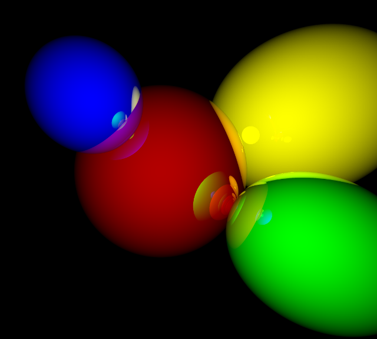

krayser
===
Kotlin ray tracer. Licensed under [MIT license](LICENSE)

### Current status
Early development. It can render reflective spheres, but code is still
in draft state, so it looks very ugly.

